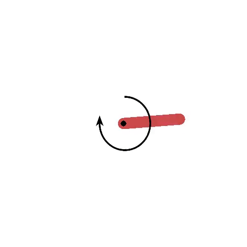
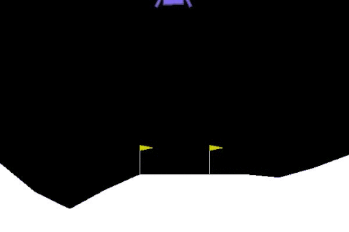
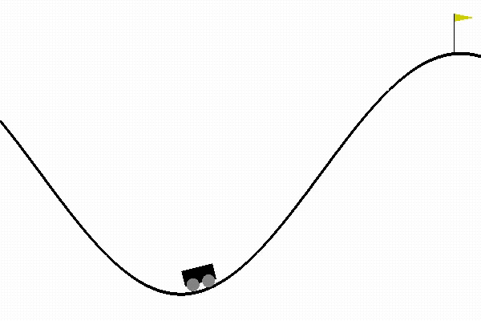
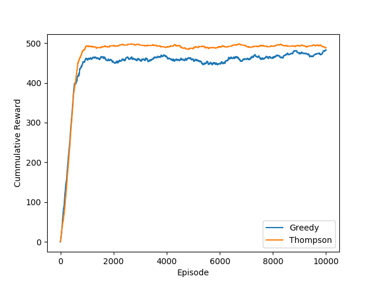

# Reinforce Adventure
This Repository contains my implementation of popular algorithms on popular environments.

Repository contains code for - 

##  Inverted Pendulum Problem

- [DDPG ( Deep Deterministic Policy Gradient )](https://github.com/amifunny/Reinforce_Adventure/blob/master/DDPG_Keras_Example_wtih_Pendulum.ipynb)
	Also on [official keras-examples](https://keras.io/examples/rl/ddpg_pendulum/)

## Cartpole Problem
	
- [Actor-Critic](https://github.com/amifunny/Reinforce_Adventure/blob/master/ACTOR_CRITIC.py)
-	[Monte Carlo Method](https://github.com/amifunny/Reinforce_Adventure/blob/master/Monte_Carlo_Method.py)
-	[PPO ( Proximal Policy Optimization )](https://github.com/amifunny/Reinforce_Adventure/blob/master/PPO_Algorithms.py)
-	[Q-Learning with Neural Net](https://github.com/amifunny/Reinforce_Adventure/blob/master/Q_Learning_CartPole.py)
-	[Vanilla Policy Gradient](https://github.com/amifunny/Reinforce_Adventure/blob/master/Vanilla_policy_Gradient.py)

## Lunar Lander

- [Actor-Critic](https://github.com/amifunny/Reinforce_Adventure/blob/master/Moon_Lander_Discrete.py)
 

## Mountain Car

  - [Q-Learning with Neural Net](https://github.com/amifunny/Reinforce_Adventure/blob/master/Q_Learning_Mountain_CAR.py)
  
   
   

## Slot Machine Bandit problem

- [E-greedy & Thompson Sampling](https://github.com/amifunny/Reinforce_Adventure/blob/master/Multi_Armed_Bandits.py)

  
  

